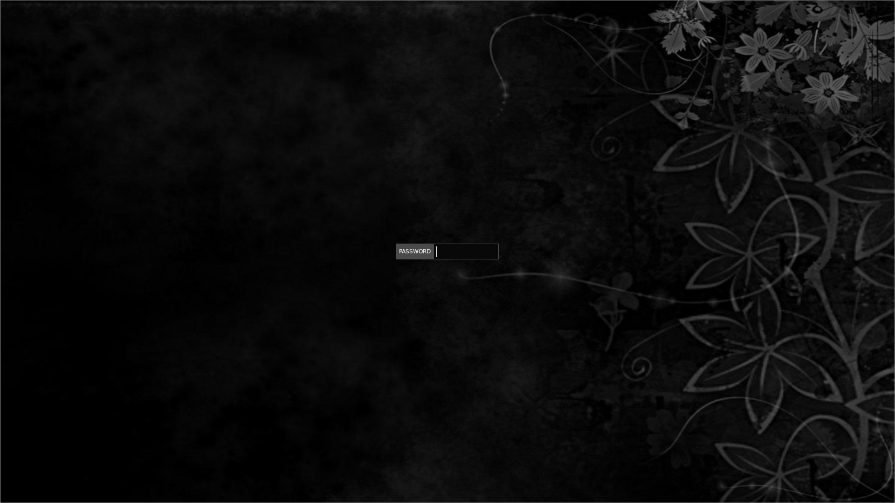
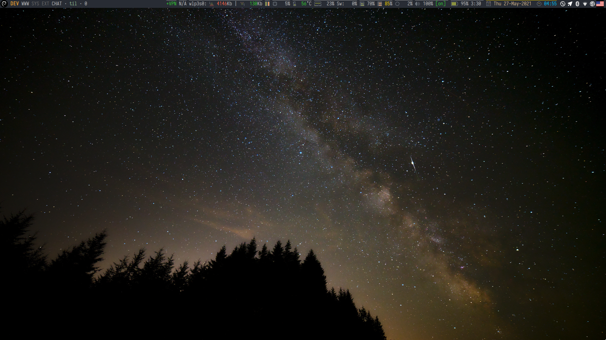
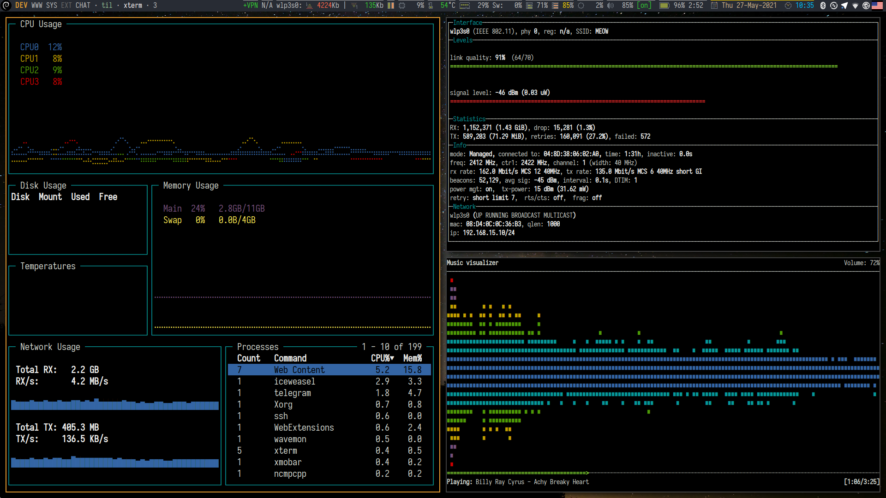
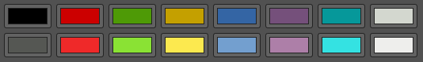

RiceRAW v.2 🌱
==============

**The Progressive Linux Desktop Environment for Professionals**

 Based on Tiling Window Manager - XMonad

_Inspired by [Luke Smith](https://lukesmith.xyz) and [Derek Tylor](http://distrotube.com/)_

### Author

Suhrob R. Nuraliev <LongOverdueVitalEnergy@Gmail.com>

### Contributors

Alexander Bordachyov <bam85g@gmail.com>

### Overview

- **Distro**           :  Debian 10 Buster
- **Display Manager**  :  slim
- **Window Manager**   :  xmonad
- **Status Bar**       :  xmobar
- **Screenlock**       :  slimlock
- **GTK3 Theme**       :  shades-of-gray-theme
- **Icon Theme**       :  papirus-icon-theme
- **Main Font**        :  iosevka
- **Compositor**       :  compton
- **Terminal**         :  xterm
- **Shell**            :  zsh
- **Editor**           :  neovim
- **File Manager**     :  nnn
- **Image Viewer**     :  sxiv
- **Others**           :  fzf, dunst, nitrogen, newsboat, ncmpcpp, zathura ...

Full list of favorite Linux packages: [packages.ods](packages.ods)

You can get all dotfiles [here](dotfiles/)

See the source files [here](sources/)

### Screenshots








PART 1/2 Distro Installation Workflow
-------------------------------------
Linux Distro is DEBIAN 10 Buster

**Tip**: Use `timeshift` software to facilitate the process of building Linux

### Partitioning (MBR)

**Linux Swap**

_Method #1: Create a Linux Swap Partition_

```
| # | type    | file system | mount point | device    |
|---|---------|-------------|-------------|-----------|
| 1 | primary | ext4        | /           | /dev/sda1 |
| 2 | primary | swap        |             | /dev/sda2 |
```

_Method #2: Create a Linux Swap File_

Create a file

```bash
$ sudo fallocate -l 1G /1G.swap
```

Set permission

```bash
$ sudo chmod 600 /1G.swap
```

Format the file to swap

```bash
$ sudo mkswap /1G.swap
```

Enable the swap

```bash
$ sudo swapon /1G.swap
```

Edit the `/etc/fstab` file and add the following:

```
/1G.swap swap swap defaults 0 0
```

Reboot and check the status of the swap file:

```bash
$ free -h
```

_Adjust the Swappiness value_

Verify the swappiness value (default swappiness value is 60)

```bash
$ cat /proc/sys/vm/swappiness
```

Edit the file `/etc/sysctl.conf` and add the following:

```
vm.swappiness=10
```

**Partitioning example**

Partitioning scheme with encryption and swap file method

```
Encrypted volume (sda2_crypt) - 250 GB Linux device-mapper (crypt)
| # |         | size | file system | mount point |
|---|         |------|-------------|-------------|
| 1 |         | 250G | ext4        | /           |

SSD drive (sda) - 256 GB
| # | type    | size | file system | mount point | device    |
|---|---------|------|-------------|-------------|-----------|
| 1 | primary | 512M | ext4        | /boot       | /dev/sda1 |
| 2 | primary | 250G | crypto      | (sda2_crypt)| /dev/sda2 |
```

### Grub menu colors (optional)

Edit `/boot/grub/grub.cfg` to change a boot menu colors:

```
set menu_color_normal=dark-gray/black
set menu_color_highlight=black/dark-gray
```
### Network

Install necessary packages

```bash
$ sudo apt install network-manager
```

Configure network connection via TUI

```bash
$ nmtui
```

Non-free Wi-Fi drivers

```bash
$ sudo apt install firmware-iwlwifi
```

### System locale

Add `LC_ALL="en_US.UTF-8"` line in `/etc/default/locale` file

```
#  File generated by update-locale
LANG="en_US.UTF-8"
LANGUAGE="en_US:en"
LC_ALL="en_US.UTF-8"
```

Locale-specific information

```bash
[suhrob@RAW ~]$ locale -a
C
C.UTF-8
en_US.utf8
POSIX

[suhrob@RAW ~]$ locale
LANG=en_US.UTF-8
LANGUAGE=en_US:en
LC_CTYPE="en_US.UTF-8"
LC_NUMERIC="en_US.UTF-8"
LC_TIME="en_US.UTF-8"
LC_COLLATE="en_US.UTF-8"
LC_MONETARY="en_US.UTF-8"
LC_MESSAGES="en_US.UTF-8"
LC_PAPER="en_US.UTF-8"
LC_NAME="en_US.UTF-8"
LC_ADDRESS="en_US.UTF-8"
LC_TELEPHONE="en_US.UTF-8"
LC_MEASUREMENT="en_US.UTF-8"
LC_IDENTIFICATION="en_US.UTF-8"
LC_ALL="en_US.UTF-8"
```

### ISO files as an offline repository

Create the folders (mount points) to mount the ISO files

  ```bash
$ sudo mkdir -p /mnt/repo_1
$ sudo mkdir -p /mnt/repo_2
$ sudo mkdir -p /mnt/repo_3
 ```

Auto mount ISO files

- Method #1: Edit `/etc/fstab`

```
/iso/debian_dvd/debian-10.2.0-amd64-DVD-1.iso /mnt/repo_1/ udf,iso9660 loop 0 0
/iso/debian_dvd/debian-10.2.0-amd64-DVD-2.iso /mnt/repo_2/ udf,iso9660 loop 0 0
/iso/debian_dvd/debian-10.2.0-amd64-DVD-3.iso /mnt/repo_3/ udf,iso9660 loop 0 0
```

- Method #2: Configure cron job for root user `sudo crontab -e`

```
@reboot mount -o loop /iso/debian_dvd/debian-10.2.0-amd64-DVD-1.iso /mnt/repo_1/
@reboot mount -o loop /iso/debian_dvd/debian-10.2.0-amd64-DVD-2.iso /mnt/repo_1/
@reboot mount -o loop /iso/debian_dvd/debian-10.2.0-amd64-DVD-3.iso /mnt/repo_1/
```

Configure `/etc/apt/sources.list`

```
deb [ trusted=yes ] file:/mnt/repo_1/ buster main contrib
deb [ trusted=yes ] file:/mnt/repo_2/ buster main contrib
deb [ trusted=yes ] file:/mnt/repo_3/ buster main contrib
```

Update

```bash
$ sudo apt update
```

### X Window Server

* Install X.Org Server

```bash
$ sudo apt install xorg
```

* XDG User Directories

Create a local configuration file

```bash
$ cp /etc/xdg/user-dirs.defaults ~/.config/user-dirs.dirs
```

File `~/.config/user-dirs.dirs` content

```
XDG_DESKTOP_DIR="$HOME/Desktop"
XDG_DOWNLOAD_DIR="$HOME/Downloads"
XDG_TEMPLATES_DIR="$HOME/Templates"
XDG_PUBLICSHARE_DIR="$HOME/Public"
XDG_DOCUMENTS_DIR="$HOME/Documents"
XDG_MUSIC_DIR="$HOME/Music"
XDG_PICTURES_DIR="$HOME/Pictures"
XDG_VIDEOS_DIR="$HOME/Videos"
```

Create a full suite of localized default user directories

```bash
$ xdg-user-dirs-update
```

### Backlight control

Install xbacklight package

```
$ sudo apt install xbacklight
```


Check the backlight directory

```
[suhrob@RAW ~]$ ls /sys/class/backlight/
intel_backlight
```

Get the `Identifier` value by running `xrandr --verbose`

```bash
[suhrob@RAW ~]$ xrandr --verbose
Screen 0: minimum 8 x 8, current 1920 x 1080, maximum 32767 x 32767
eDP1 connected primary 1920x1080+0+0 (0x4b) normal (normal left inverted right x axis y axis) 310mm x 170mm
	Identifier: 0x43
	Timestamp:  3489
	Subpixel:   unknown
	Gamma:      1.0:1.2:1.4
	Brightness: 1.0

...
```

Create `/etc/X11/xorg.conf` and add the following:

```
Section "Device"
    Identifier  "0x43"
    Driver      "intel"
    Option      "Backlight"  "intel_backlight"
EndSection
```

### Fonts

Install `fontconfig`

```bash
$ sudo apt install fontconfig fontconfig-config
```

Fontconfig configuration

```bash
$ sudo dpkg-reconfigure fontconfig-config fontconfig
```

For more information please see man pages

```bash
$ man fonts.conf
```

Install fonts from repository

```bash
$ sudo apt install ttf-ancient-fonts-symbola  ttf-unifont  fonts-powerline fonts-symbola fonts-liberation*
```

Download Emoji font [joypixel-android.ttf](https://www.joypixels.com) and put file into `~/.fonts` folder. Or get it from [here](dotfiles/.fonts)

Build iosevka font from source [iosevka-regular.ttf](https://github.com/be5invis/Iosevka) and put iosevka-regular.ttf into `~/.fonts` folder. Or get it from [here](dotfiles/.fonts)

Check Emoji coverage

```bash
$ surf https://getemoji.com
```

Add one line in to `~/.bashrc` to set FONTCONFIG_PATH env

```bash
export FONTCONFIG_PATH="/etc/fonts"
```

Create fonts configuration file `~/.config/fontconfig/fonts.conf`

```xml
<?xml version='1.0'?>
<!DOCTYPE fontconfig SYSTEM 'fonts.dtd'>
<fontconfig>

 <alias>
    <family>serif</family>
    <prefer><family>Liberation Serif</family></prefer>
  </alias>
  <alias>
    <family>sans-serif</family>
    <prefer><family>Liberation Sans</family></prefer>
  </alias>
  <alias>
    <family>sans</family>
    <prefer><family>Liberation Sans</family></prefer>
  </alias>
  <alias>
    <family>monospace</family>
    <prefer><family>Iosevka</family></prefer>
  </alias>

  <!-- This sets Symbola as the final fallback font for the monospace font family. -->
  <match target="pattern">
    <test name="family"><string>monospace</string></test>
    <edit name="family" mode="append"><string>Symbola</string></edit>
  </match>

</fontconfig>
```

Verify system font families

```
[suhrob@RAW ~]$ fc-match serif
LiberationSerif-Regular.ttf: "Liberation Serif" "Regular"
[suhrob@RAW ~]$ fc-match sans-serif
LiberationSans-Regular.ttf: "Liberation Sans" "Regular"
[suhrob@RAW ~]$ fc-match sans
LiberationSans-Regular.ttf: "Liberation Sans" "Regular"
[suhrob@RAW ~]$ fc-match monospace
LiberationMono-Regular.ttf: "Liberation Mono" "Regular"
```

### GTK3 Theme

Download [Shades Of Gray Theme Collection](https://www.gnome-look.org/p/1244058/) and extract harvest variation in to `~/.themes` folder

Or get it from [here](dotfiles/.themes/)

### Transparency, Fade and Shadow Effects

Install packages

```bash
$ sudo apt install compton compton-conf
```

Execute `compton-conf` to generate config file and configuring

|                    Setting                      |  Value  |
|-------------------------------------------------|---------|
| Avoid drawing shadows on dock/panel windows     | uncheck |
| Don't draw shadows on DND windows               | uncheck |
| The left offset for shadows                     | -5      |
| The top offset for shadows                      | -5      |
| The opacity for menus                           | 1.00    |
| Opacity of window titlebars and borders         | 1.00    |
| Opacity change between steps while fading in    | 0.060   |
| Opacity change between steps while fading out   | 0.060   |


### SLiM Display Manager

Install slim package

```bash
$ sudo apt install slim
```

For more information please see man pages

```
man slim
man slimlock
```

Slim configuration `/etc/slim.conf`

```
login_cmd          exec /bin/bash -login ~/.xinitrc
default_user       suhrob
focus_password     yes
current_theme      micro-theme
```

Slimlock configuration `/etc/slimlock.conf`

```
show_username 0
tty_lock 0
```

Check for [Slim configuration files and custom theme](sources/slim-files/)

### Askpass helper

Install graphical helper program which is executed to read the user's password:

```bash
sudo apt install ssh-askpass
```

Configure `/etc/sudo.conf`. For more information please see `man sudo.conf` manual

```
#
# An askpass helper program may be specified to provide a graphical
# password prompt for "sudo -A" support.  Sudo does not ship with
# its own askpass program but can use the OpenSSH askpass.
#
# Use the OpenSSH askpass
Path askpass /usr/bin/ssh-askpass
```

Alternative configuration method is to add line in `~/.bashrc`

```bash
export SUDO_ASKPASS="/ust/bin/ssh-askpass"
```

Please see below an example of how to check askpass


```bash
sudo -A timeshift-gtk
```

### Audio & Bluetooth

Install necessary packages

```bash
$ sudo apt install alsa-utils
$ sudo apt install pulseaudio pulseaudio-utils pulseaudio-module-bluetooth blueman bluez-firmware pulsemixer
```

### Playing Music Daemon (mpd)

Install package

```bash
$ sudo apt install mpd
```

Disable systemd services

```bash
$ sudo systemctl disable mpd.service mpd.socket
```

Create directories for user

```bash
$ mkdir -p ~/.config/mpd ~/.config/mpd/playlists
```

Create `~/.config/mpd/mpd.conf` and add the following:

```
music_directory        "~/Music"
playlist_directory     "~/.config/mpd/playlists"
db_file                "~/.config/mpd/tag_cache"
log_file               "~/.config/mpd/mpd.log"
pid_file               "~/.config/mpd/pid"
state_file             "~/.config/mpd/state"
sticker_file           "~/.config/mpd/sticker.sql"

bind_to_address        "localhost"
restore_paused         "yes"
auto_update            "yes"

# volume_normalization "yes"
filesystem_charset     "UTF-8"

audio_output {
	type               "pulse"
	name               "pulse audio"
	mixer_type         "software"
}

audio_output {
    type              "fifo"
    name              "toggle_visualizer"
    path              "/tmp/mpd.fifo"
    format            "44100:16:2"
}

input {
        plugin        "curl"
}

input {
        enabled       "no"
        plugin        "qobuz"
}

input {
        enabled       "no"
        plugin        "tidal"
}

decoder {
        enabled       "no"
        plugin        "hybrid_dsd"
}
```

Add `mpd &` into `.xinitrc`

Install mpd client

### Editor

Replace vim with neovim

```bash
$ sudo apt pure vim-*
$ sudo apt install neovim neovim-qt
```

### Terminal

Package: `xterm`

Color scheme: `tango`

Colors HEX code:

```
xterm*background:  #000000
xterm*foreground:  #d3d7cf
! Black
xterm*color0:      #000000
xterm*color8:      #555753
! Red
xterm*color1:      #CC0000
xterm*color9:      #EF2929
! Green
xterm*color2:      #4E9A06
xterm*color10:     #8AE234
! Yellow
xterm*color3:      #C4A000
xterm*color11:     #FCE94F
! Blue
xterm*color4:      #3465A4
xterm*color12:     #739FCF
! Magenda
xterm*color5:      #75507B
xterm*color13:     #AD7FA8
! Cyan
xterm*color6:      #06989A
xterm*color14:     #34E2E2
! White
xterm*color7:      #D3D7CF
xterm*color15:     #EEEEEC
```



### ZSH as default shell

Install `zsh`

```bash
$ sudo apt install zsh-syntax-hihghlighting
```

Change login shell

```bash
$ chsh -s /bin/zsh
```

PART 2/2 XMonad Installation Workflow
-------------------------------------
links:
* [xmonad: A tiling window manager](https://hackage.haskell.org/package/xmonad)
* [xmonad-contrib: Third party extensions for xmonad](https://hackage.haskell.org/package/xmonad-contrib)
* [xmobar: A Minimalistic Text Based Status Bar](https://hackage.haskell.org/package/xmobar)

### Cabal, xmonad, xmonad-contrib, xmobar installation

Install `cabal-install` from repository and update the list of available packages:

```bash
$ sudo aptitude install cabal-install
$ cabal update
```

Install newer version of `cabal-install` via already installed `cabal-install`:

```bash
$ cabal install --project-file=cabal.project.release cabal-install
$ ~/.cabal/bin/cabal update
```

Purge old version of `cabal-install`. Remove old folder `~/.ghc`
and old version of `~/.cabal/config` file:

```bash
$ sudo aptitude purge cabal-install
$ rm -rf ~/.ghc
$ rm ~/.cabal/config
```

> NOTE: file `~/.cabal/config` creates automatically then executed
> newer installed `cabal-install`


Update the list of available packages for newer version of `cabal-install`:

```bash
$ ~/.cabal/bin/cabal update
```

Install `xmonad`, `xmonad-contrib` and `xmobar`:

```bash
$ ~/.cabal/bin/cabal install xmonad  --overwrite-policy=always
$ ~/.cabal/bin/cabal install xmonad-contrib  --overwrite-policy=always
$ ~/.cabal/bin/cabal install xmobar --flags="all_extensions" --overwrite-policy=always
```

Add `~/.cabal/bin` to user PATH by adding line in `~/.bashrc`:

```bash
export PATH=$PATH:"$HOME/.cabal/bin"
```

> NOTE: to migrate `cabal-install`, `xmonad`, `xmonad-contrib`
> and `xmobar` just copy `~/.cabal`

### Copy required dotfiles to the `$HOME` directory

You can get all dotfiles [here](dotfiles/)
